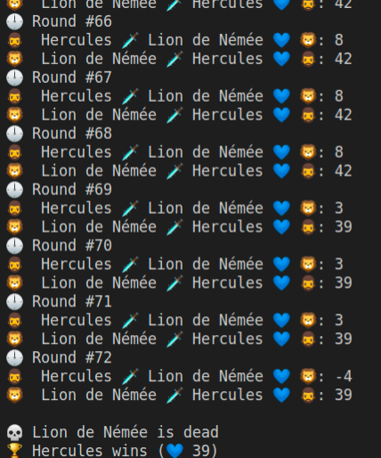

# Workshop 1 : Le lion de Némée

Prérequis : cloner ce repository.

## Préparation

Heraclès doit vaincre le féroce lion de Némée, connu pour sa peau impénétrable, le rendant très difficile à blesser. Avant de débuter sa quête, tout héros doit se préparer un peu :

- Créer une classe Fighter (dans un fichier *src/Fighter.php*) avec
    la constante
    - MAX_LIFE = 100 : les combattants ont 100 points de vie max

    les propriétés
    - name : le nom du combattant
    - icon : une icone pour le représenter (https://emojipedia.org/) : pour l'instant tu vas travailler dans le terminal uniquement, les emoticones permettent d'avoir un rendu un peu plus sympathique en attendant de travailler dans le navigateur (ça sera pour bientôt)
    - strength : la force du combattant (permettra de calculer les points de dégats lors d'une attaque)
    - dexterity : la dextérité du combattant (permettra de calculer les points de défense qui viendront limiter les dégats reçus)
    - life : les points de vie du combattant (initialisé à MAX_LIFE, ainsi ils débutent tous avec 100 point de vie.)

Il y aurait potentiellement plein d'autres choses à ajouter mais pour un début c'est déjà pas mal !

- Dans le fichier *index.php*, créer deux instances de la classe Fighter, pour :
- Heracles 🧔, force de 20, dextérité de 6 
- Lion de Némée 🦁 force de 11, dextérité de 13 
(tu peux t'amuser à faire varier ses valeurs mais celles-ci te donneront des combats relativement équilibrés)

HINT: un *constructeur* va être nécessaire dans ta classe pour initialiser ces propriétés avec des valeurs différentes pour Heracles et le Lion. 
HINT2: n'oublie pas de faire un require de ton fichier *Fighter.php* si tu veux pouvoir l'utiliser depuis ton fichier *index.php*.

Une fois les deux objets instanciés, affiche le nom, l'icone et la vie 💙 (tu dois avoir 100 au départ) de chacun des deux combattants pour t'assurer que tout fonctionne bien. Pour afficher ton code, tu vas utiliser PHP uniquement en mode CLI (pas besoin de lancer de serveur PHP).
Pour se faire tape juste : `php index.php` dans ton terminal.


## FIGHT !

Heracles affute son épée, attache son bouclier. Il est prêt à en découdre !

- Retourne dans *Fighter.php* et crée une première methode *getDefense()* qui te donnera ton score de défense.
Pour le moment, le score de défense correspond tout simplement à la dextérité du Fighter (mais plus tard nous complexifierons ce calcul donc c'est bien que la méthode existe)
- Créé ensuite une méthode *getDamage()*. Cette méthode doit te renvoyer les points de dégats d'une attaque. Cette valeur sera un nombre aléatoire compris entre 1 et la force du combattant (utilise rand()) 
- Enfin créé une méthode *fight()* qui va te permettre d'attaquer l'ennemi. Pour déterminer qui tu vas taper, la méthode *fight()* va prendre en paramètre un autre objet Fighter ! Dans le corps de ta méthode, fais en sorte de :
    - récupérer le nombre de point de dégats que fait l'**attaquant** à l'aide de *getDamage()* (les dégats faisant appel à un nombre aléatoire, la valeur renvoyée par *getDamage()* varie donc à chaque appel de la méthode). 
    - attenuer les dégats en soustrayant aux dommages le score de défense de l'**attaqué** (sans jamais aller en dessous de zéro)
    - diminuer le nombre de points de vie de l'**attaqué** par la valeur ainsi obtenue.

En résumé : 
```
nouveaux points de vie de l'attaqué = points de vie actuels de l'attaqué - (dommage de l'attaquant - défense de l'attaqué)
```
sachant que `(dommage de l'attaquant - défense de l'attaqué)` ne doit pas être négatif.

Voilà, ta classe est prête, tu n'as plus qu'à l'utiliser ! 

## 🗡️ Il n'en restera qu'un

Heracles pénètre dans la grotte, le lion est là, ses yeux rouges pointés vers l'intrus. Le combat est imminent.

- Dans le fichier *index.php*, créé une boucle permettant d'effectuer un combat à mort ! Tant qu'un des deux ennemis a une vie > 0, le combat continue donc.
Remarque : la vie d'un combattant ne peut pas tomber en dessous de zéro, vérifie cela au moment où tu modifies la propriété *life*;

 À chaque "round" 🕛, Heracles attaque le lion, puis le lion attaque Heracles. Tu dois afficher le numéro du round, qui attaque qui, et les points de vie restant. Une fois l'un des deux vaincus, tu dois alors afficher le vainqueur 🏆 et le perdant 💀. La capture d'écran ci-dessous te résume ce qui est attendu. 




BONUS : créer une nouvelle méthode *isDead()* peut t'aider à optimiser le code.

Une fois que tu as fini, n'hésite pas à modifier le code et à ajouter de nouvelles fonctionnalités.
Un code "propre" te sera fourni au début du prochain atelier.